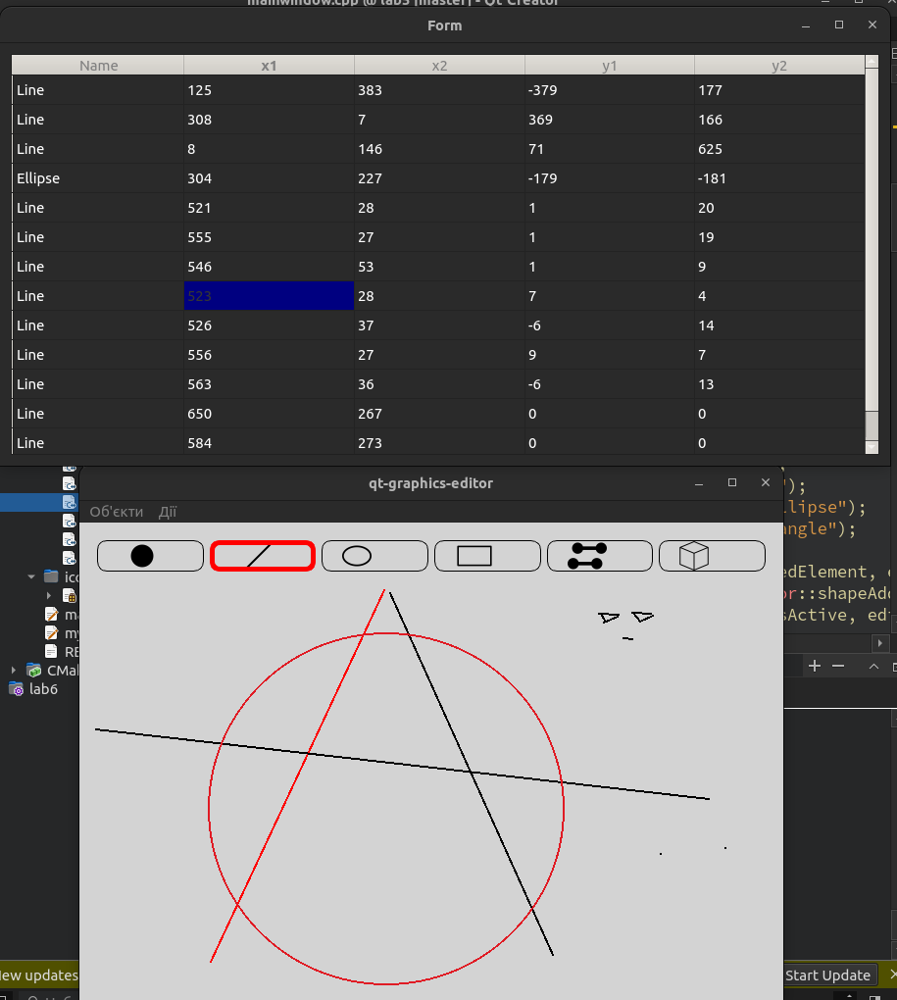
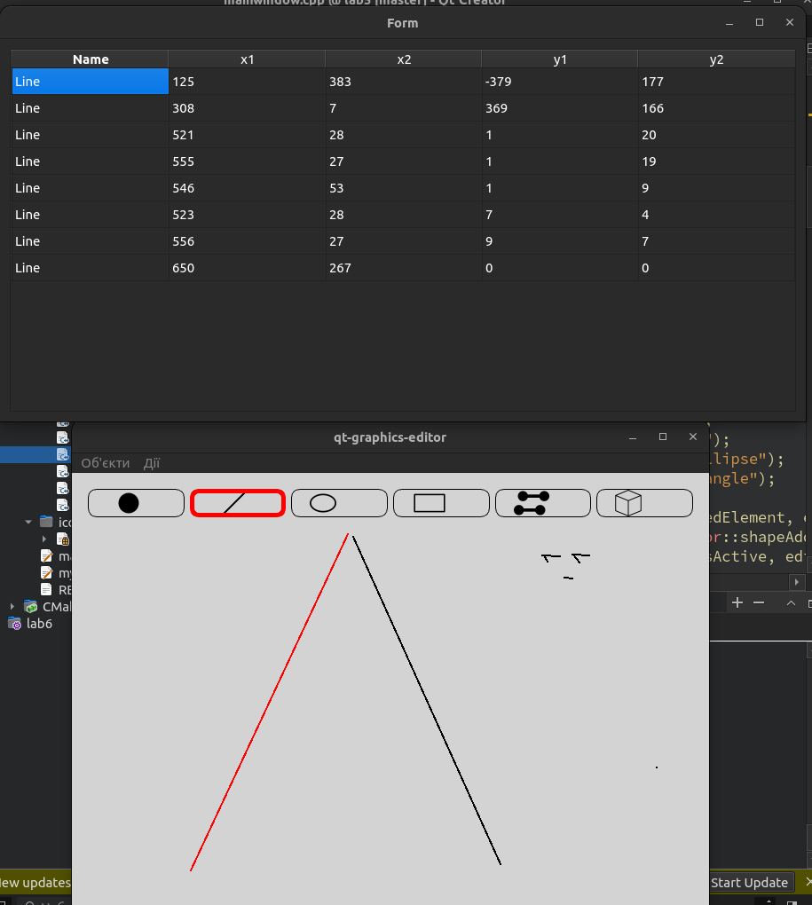
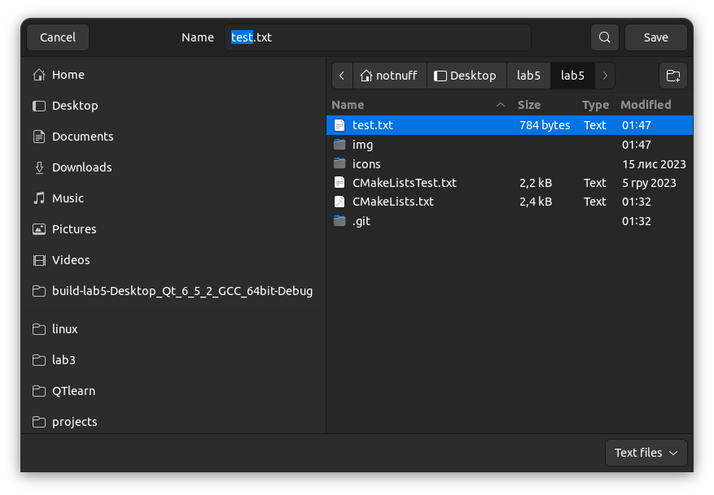

# This is an example of basic graphics editor

It`s all done using C++ with Qt framework.
The main goal of this project was to learn OOP principles, and it was achieved.

Here are some screenshots of its features:

-  The editor itself

-  The table with shapes contest

-  Removing shapes from the table feature

-  Saving current shapes state feature

